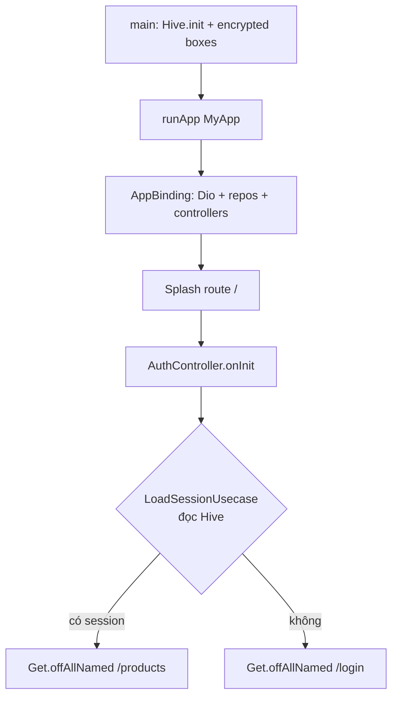
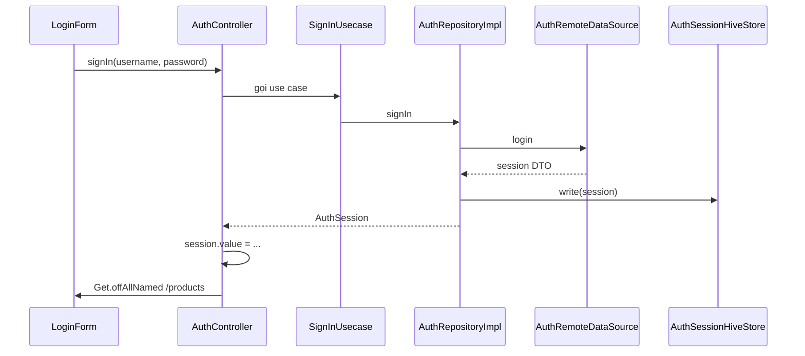
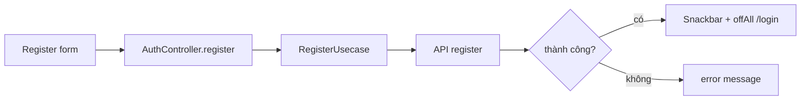
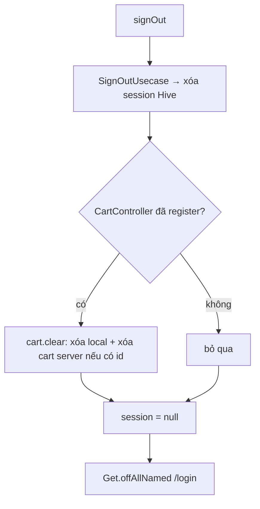
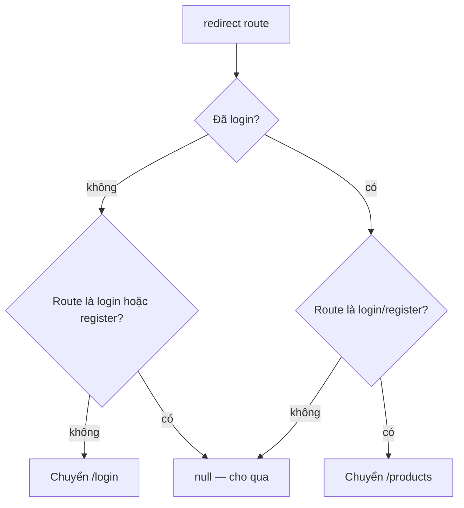
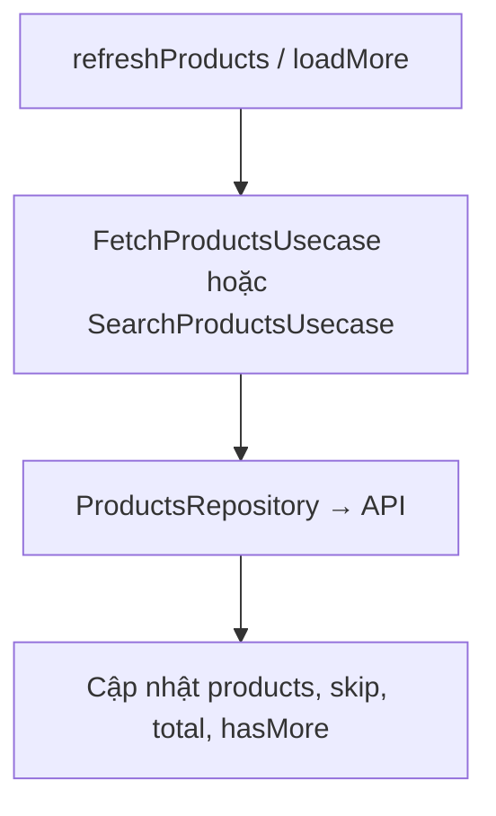
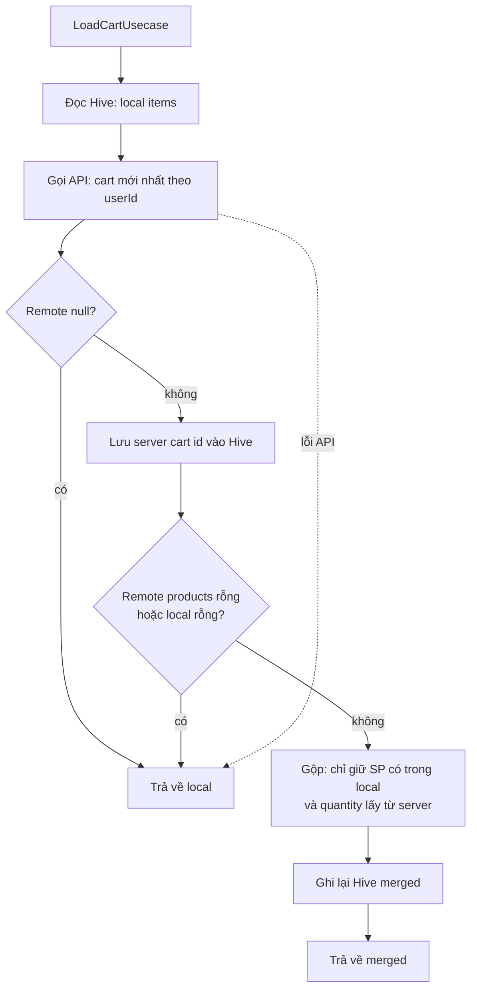
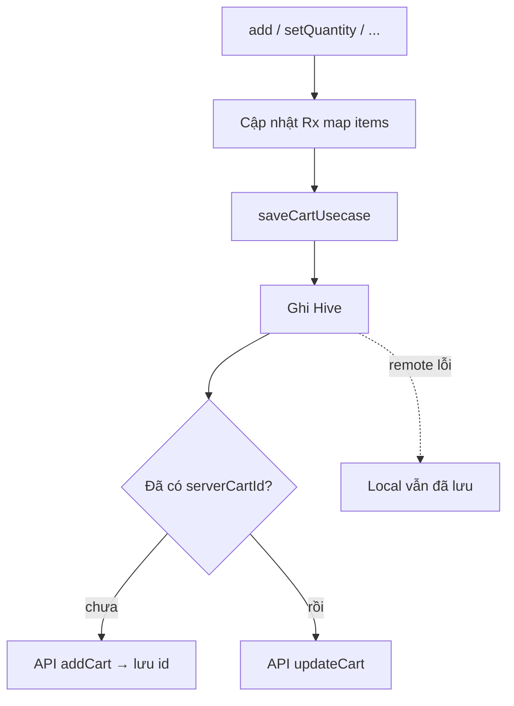
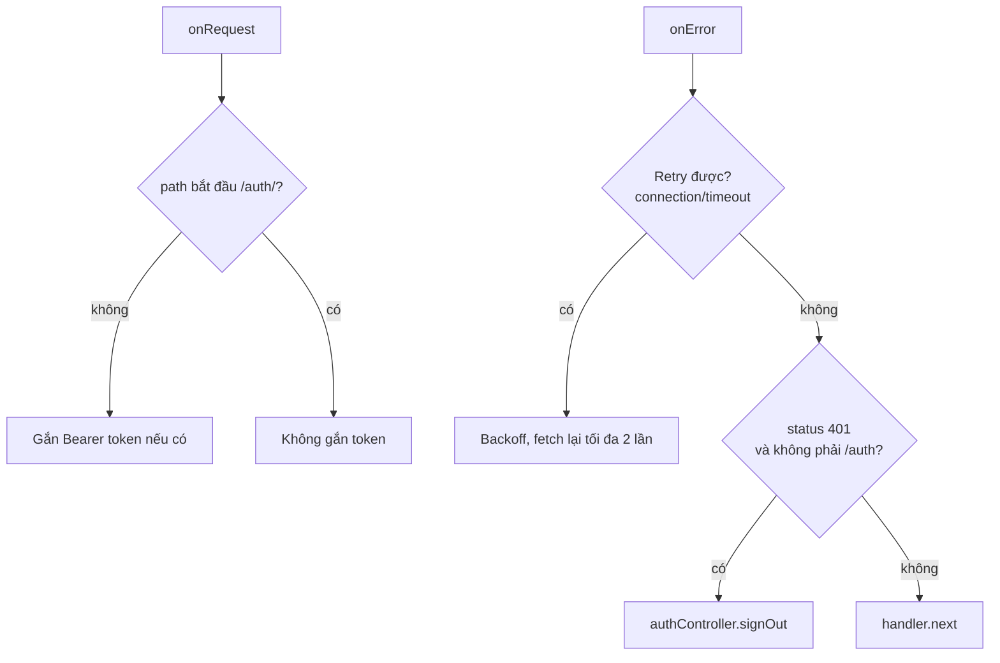
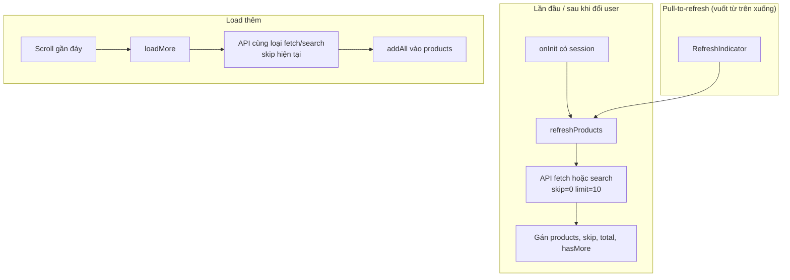

# Luồng hoạt động theo chức năng

Tài liệu mô tả luồng **theo code hiện tại** (`lib/`). Project bố trí theo **Clean Architecture** từng feature (domain → data → presentation); các luồng dưới đây đi qua **use case** và **repository** chứ không gọi Dio/Hive trực tiếp từ UI. Có thể dán các khối `mermaid` vào Notion, GitHub, hoặc [mermaid.live](https://mermaid.live).

---

## 1. Khởi động ứng dụng

**Thứ tự:** `main` → khởi tạo Hive + mở box mã hóa (session + cart) → `runApp` → `AppBinding` đăng ký Dio, Auth, Products, Cart → `GetMaterialApp` mở route splash → `AuthController.onInit` gọi `_onAppStarted`.

**Ý chính:** Session chỉ đọc từ **local (Hive)** lúc mở app; không gọi API refresh token trong repo này. Điều hướng sau splash dùng `offAll` nên không quay lại splash bằng nút back.

---

## 2. Đăng nhập

**Lỗi:** Exception → `AppErrorMapper` → `error` trên controller; UI hiển thị theo reactive state.

---

## 3. Đăng ký

**Lưu ý:** Đăng ký **không** tự đăng nhập; user phải login sau.

---

## 4. Đăng xuất

---

## 5. AuthMiddleware (bảo vệ route)

Chạy khi điều hướng tới các `GetPage` có `middlewares: [AuthMiddleware()]`.

**Route công khai khi chưa login:** chỉ `/login` và `/register`. Mọi route khác (products, cart, add/edit/detail…) bị chặn nếu chưa có `session`.

---

## 6. Sản phẩm (danh sách, tìm kiếm, phân trang)

**`ProductsController`:**

- `onInit`: nếu đã có `userId` trong session → `refreshProducts()`.
- `ever(session)`: đổi user hoặc logout → reset state hoặc load lại.
- `searchQuery` được **debounce 450ms** → mỗi lần đổi query gọi lại `refreshProducts()` (gọi fetch hoặc search tùy logic trong controller).

**Thêm / sửa / xóa:** Form gọi `AddProductUsecase` / `UpdateProductUsecase` / `DeleteProductUsecase` → sau thành công controller cập nhật danh sách hoặc refresh tùy chỗ gọi.

**Dio:** Mọi request **không** phải `/auth/*` được gắn header `Authorization: Bearer <accessToken>` nếu có session.

---

## 7. Giỏ hàng

### 7.1 Khi nào load giỏ?

- `CartController.onInit`: nếu có `userId` → `_loadCart(userId)`.
- `ever(session)`: đổi user → load giỏ user mới; logout → `items.clear()`.

### 7.2 Load — merge local và server

### 7.3 Lưu sau khi thêm / đổi số lượng / xóa dòng

### 7.4 Clear (logout hoặc nút clear)

- Xóa map trong memory, gọi `clearCartUsecase`: Hive rỗng, nếu có `serverCartId` thì gọi API xóa cart, sau đó xóa id trên local.

---

## 8. Lớp HTTP chung (Dio)

**Ý chính:** Token hết hạn / 401 trên API thường → **sign out** (xóa session, clear cart nếu có), user về login.

---

## 9. Tính năng theo màn hình (screen)

### Splash (`/` — `SplashPage`)

- Hiển thị **CircularProgressIndicator** full màn hình.
- **Không** tự chuyển route trong `SplashPage`: `AuthController` (khởi tạo cùng `AppBinding`) trong `_onAppStarted` đọc session rồi gọi `Get.offAllNamed` tới `/products` hoặc `/login`.
- Debug: có thể bật nút **dio_log** (xem `app_routes.dart`).

---

### Login (`LoginPage` + `LoginForm`)

- Form: username, password, validate; nút đăng nhập / link sang đăng ký.
- Submit → `AuthController.signIn` → thành công thì `offAll` sang **Products**; lỗi hiển thị qua `error` trên controller.

---

### Register (`RegisterPage` + `RegisterForm`)

- Form đăng ký → `AuthController.register` → thành công: snackbar + về **Login** (không tự đăng nhập).

---

### Danh sách sản phẩm (`ProductsPage`)

**Diễn giải gợi ý khi thuyết trình**

> Màn hình này gọi **API danh sách sản phẩm** và hiển thị kết quả trên lưới. **Mỗi lần gọi API chỉ lấy về 10 phần tử.** Khi người dùng **kéo xuống gần cuối danh sách**, app gọi API lần nữa để **load thêm 10 phần tử tiếp theo** (phân trang / **load more**). Khi người dùng **vuốt từ mép trên xuống**, màn hình **refresh** — tải lại danh sách từ đầu (**pull to refresh**).

| Hành vi trên UI | Điều gì xảy ra trong code |
|-----------------|---------------------------|
| **Vào màn hình lần đầu (đã login)** | `ProductsController.onInit` thấy có `userId` → gọi **`refreshProducts()`** → gọi API lấy trang đầu (`skip = 0`, `limit = 10`). |
| **Load sản phẩm (trạng thái loading)** | Khi `isLoading == true` và `products` rỗng → grid hiển thị **spinner giữa màn hình** (`ProductGrid`). |
| **Reload / làm mới danh sách** | Người dùng **kéo xuống (pull-to-refresh)** → `RefreshIndicator.onRefresh` gọi **`refreshProducts`**: xóa list, reset `skip` / `hasMore`, fetch lại **từ đầu**. Nếu ô tìm kiếm đang có chữ, bản reload vẫn dùng **cùng bộ lọc tìm kiếm** (vì `_activeQuery` đã được set). |
| **Load thêm (pagination)** | Kéo grid gần **đáy (còn ~200px)** → `NotificationListener` gọi **`loadMore()`**: nối thêm sản phẩm, tăng `skip`, cập nhật `hasMore`. Cuối list có thêm một ô **spinner** khi `isLoadingMore`. |
| **Tìm kiếm** | Gõ trong `ProductSearchBar` → `onSearchChanged` cập nhật query → **`searchQuery` debounce 450ms** → `refreshProducts` lại. Ô trống → quay về fetch danh sách thường (không search). Nút **clear (X)** xóa text và gọi lại `onSearchChanged('')`. |
| **Lỗi khi chưa có dữ liệu** | Nếu `error != null` và list rỗng → hiển thị dòng lỗi text giữa màn hình. |
| **Chạm một sản phẩm** | `Get.to(ProductDetailPage(product: …))` — truyền object, **không** dùng `Get.toNamed` ở đây. |
| **Nút + trên ô sản phẩm** | `cartController.add(product)` → lưu Hive + sync server; badge đỏ hiển thị số lượng trong giỏ; có snackbar “Added to cart”. |
| **FAB (+)** | Mở `AddProductPage` (`Get.to`). |
| **Icon giỏ** | Mở `CartPage` (`Get.to`). |
| **Logout** | `LogoutButton` → `signOut`. |

**Ghi chú:** `refreshProducts` và `loadMore` đều dùng `_fetch`: nếu query rỗng → `FetchProductsUsecase`, có query → `SearchProductsUsecase`.

#### Kéo **xuống đáy** danh sách — load more hoạt động thế nào?

**Khác với pull-to-refresh:** *Pull-to-refresh* là **vuốt từ mép trên của list xuống** (nắm đỉnh danh sách kéo xuống) để **tải lại từ đầu**. Phần này nói về **cuộn nội dung xuống phía dưới** giống đọc Facebook: càng kéo xuống càng thấy thêm mục — đó mới là **load more**.

**Cách nói gọn khi thuyết trình**

> Danh sách ban đầu chỉ có 10 sản phẩm đầu tiên. Khi người dùng **cuộn xuống gần hết** danh sách, app **tự gọi API lần nữa** với tham số phân trang (bỏ qua số bản ghi đã hiển thị — `skip`), lấy thêm **10 sản phẩm kế tiếp** và **nối vào cuối** lưới chứ không xóa dữ liệu cũ. Nếu server báo hết dữ liệu (`hasMore = false`) thì không gọi thêm nữa. Trong lúc chờ lô mới, cuối lưới có thể hiện **vòng loading** nhỏ.

**Trong code (`ProductGrid` + `ProductsController`)**

1. **Lắng nghe cuộn:** `GridView` được bọc trong `NotificationListener<ScrollNotification>`. Mỗi lần người dùng cuộn, Flutter gửi thông báo kèm `metrics` (vị trí hiện tại, độ dài tối đa có thể cuộn, …).
2. **Ngưỡng “gần đáy”:** Khi `pixels >= maxScrollExtent - 200`, nghĩa là còn khoảng **200 logical pixel** nữa là tới đáy — coi như user sắp xem hết nội dung đã tải → trigger load more (không cần kéo **dính** đáy mới gọi).
3. **Chặn gọi trùng / gọi khi không còn trang:** Chỉ gọi `loadMore()` khi:
   - `hasMore == true` (theo API, tổng số bản ghi vẫn lớn hơn số ô đang hiển thị),
   - không đang **`isLoading`** (refresh đầu trang),
   - không đang **`isLoadingMore`** (đã có một request load more đang chạy).
4. **`loadMore()` làm gì:** Bật `isLoadingMore`, gọi `_fetch(skip: _skip)` với `limit = 10` (`pageSize`), nhận về trang tiếp theo; **`addAll`** vào list `products`; cập nhật `_skip` (vị trí kế tiếp để lần sau skip đúng) và **`hasMore`** (so sánh `products.length` với `_total` từ server). Tắt `isLoadingMore` khi xong.
5. **Ô cuối lưới:** Khi `isLoadingMore`, `itemCount` tăng thêm 1 để vẽ thêm một **ô chỉ có `CircularProgressIndicator`** báo đang tải thêm.

---

### Chi tiết sản phẩm (`ProductDetailPage`)

- Ảnh (`CachedNetworkImage` nếu có URL), thông tin, **`AddToCartButton`**.
- **Sửa:** `Get.toNamed(AppRoutes.editProduct, arguments: product)`.
- **Xóa:** `ProductActionButtons` — sau khi xóa xong callback `onDeleted` → `Get.back()` khỏi màn chi tiết.

---

### Thêm sản phẩm (`AddProductPage`)

- `ProductForm` + `AddProductController.submit` → `ProductsController.addProduct` → thành công: **chèn sản phẩm mới đầu list**, tăng `_total`, **`Get.back(result: created)`** và snackbar.

---

### Sửa sản phẩm (`EditProductPage`)

- Nhận `Product` qua `Get.arguments` (binding từ route).
- Submit → `updateProduct` → cập nhật phần tử trong `products` nếu còn trong list; thành công → **`Get.back(result: updated)`** và snackbar.

---

### Giỏ hàng (`CartPage`)

- **Rỗng:** dòng chữ “Your cart is empty.”
- **Có hàng:** `CartItemList` + `CartSummary` (tổng tiền).
- Mỗi dòng: **+ / −** gọi `increment` / `decrement` → cập nhật số lượng và **lưu lại** (Hive + API).
- App bar: **Clear cart** → `controller.clear`.

---

## Bảng tóm tắt theo chức năng

| Chức năng | Điểm vào chính | Dữ liệu / API |
|-----------|----------------|---------------|
| Khởi động | `main`, `AuthController._onAppStarted` | Hive session |
| Đăng nhập | `AuthController.signIn` | API login → Hive |
| Đăng ký | `AuthController.register` | API register |
| Đăng xuất | `AuthController.signOut` | Xóa Hive; clear cart |
| Bảo vệ route | `AuthMiddleware.redirect` | `session` trên `AuthController` |
| Sản phẩm | `ProductsController` + các page | Dio + Bearer |
| Giỏ hàng | `CartController` + `CartRepositoryImpl` | Hive trước; sync cart server sau |

File này có thể liên kết từ `README.md` nếu bạn muốn người đọc tìm luồng nhanh hơn.
